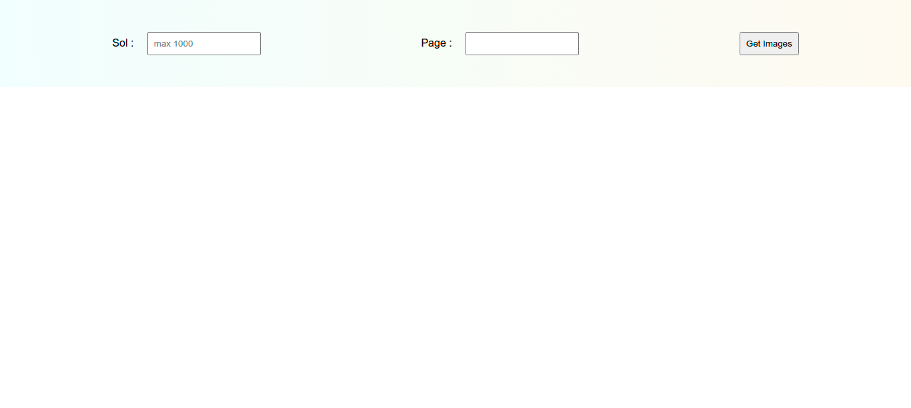
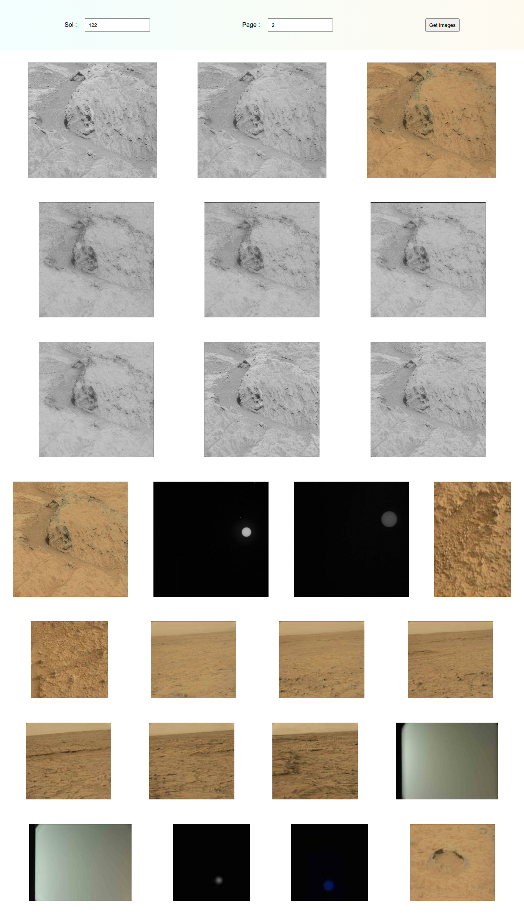

# mars-sol
- In the documentation of the NASA API, you can see that the API also works with sol (Martian rotation or day) as input. 
- This time we will take 'sol' and 'page' as input and fetch images from API  
 `(https://api.nasa.gov/mars-photos/api/v1/rovers/curiosity/photos?sol=1000&page=2&api_key=DEMO_KEY)`

 - The web page looks like this -

 

 - On entering the 'sol' and 'page', the web page would look like this -

 
